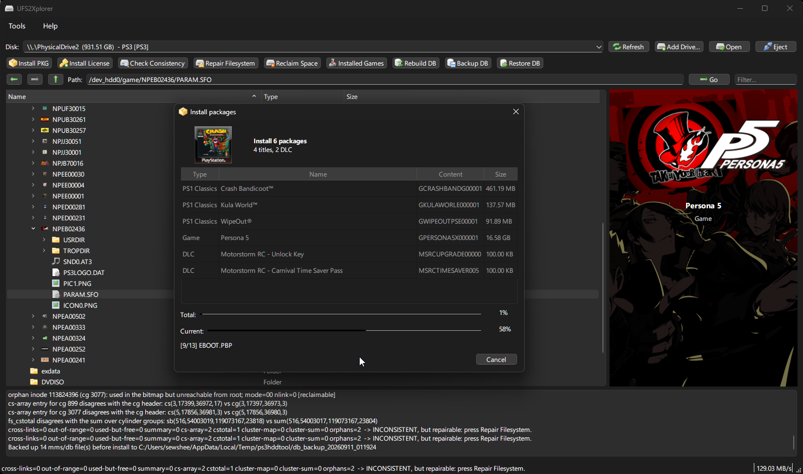

# UFS2Xplorer

A desktop app for reading and managing a PS3 hard drive on your PC.

Take the drive out of your PS3, open it on your computer, and browse it like a file manager. You can copy files in and out, install PKG games, updates and DLC straight onto the disk, install their licenses, and back up or rebuild the game database. It reads and writes the PS3's encrypted GameOS partition (UFS2), so nothing has to be done on the console itself apart from a final database rebuild.

There are already good command line readers for PS3 drives. UFS2Xplorer is aimed at people who want a proper graphical app that can also write, not just read.

UFS2Xplorer is deliberately optimized to reach the absolute maximum read and write speed your drive of choice can deliver. This is motivated by the factor that installing packages through the XMB can take **hours** if not ***days***.

> [!WARNING]
> **UFS2Xplorer is early-stage software that reads and *writes* to the HDD.**
> Incorrect writes can causee **permanent data loss.** The author is **not
> responsible** for any damage, data loss, or other issues resulting from use of
> this tool. Use entirely at your own risk, and **always dump your save files and
> files you deem important. Keep multiple backups in a safe location before changing anything.**

## What it can do

- Browse the whole drive in a tree view (copy, cut, paste, rename, extract, import)
- Install PKG files (games, updates, DLC), on their own or in a batch
- Install licenses from RAP files, for every user on the console at once
- Back up and restore the XMB game database, or flag it for a rebuild
- Check and repair the filesystem's free space accounting
- Edit a game's PARAM.SFO fields
- Safely eject the drive when you are done

Windows for now. Linux and macOS are planned.

## Warning

This writes directly to your PS3 hard drive. A wrong key, a bad cable, or pulling the drive at the wrong moment can corrupt it. Back up anything you care about first, always use the Eject button before unplugging, and do not interrupt an install. You use this at your own risk.

## Getting started

1. Connect your PS3 drive to your PC and run UFS2Xplorer.
2. Click **Add Drive** and follow the wizard: pick the disk and enter your console's EID key. Add your IDPS and account id too if you want to install licenses.
3. Select the drive and click **Open**.

The full walkthrough, including where to get your keys, is in [SETUP.md](SETUP.md).

Building from source is covered in [docs/BUILDING.md](docs/BUILDING.md).

## Third-party components

- **Qt 6** (Qt Company) under the LGPL v3.
- **OpenSSL** under the Apache License 2.0.
- **Catch2** under the Boost Software License 1.0 (used only by the tests).
- **Silk icon set 1.3** by Mark James, under CC BY 2.5.

The PS3 curve parameters, keys, and key-derivation tables used for licensing are long-published public values. The cryptography here is built on OpenSSL; no third-party code is bundled for it.

## Post 1.0.0 roadmap

- Save data backups / decryption / extraction
- 1:1 MMS database recreation to make package installation as seamless as possible, MMS is the database engine the XMB uses to register XMB icons, rebuilding the database manually mitigates the issue of packages not appearing on the XMB after using UFS2Xplorer. Reverse engineering of the engine has taken place but will take a substatial amount of timee due to Sony using a custom database engine rather than something standard like SQLite.

## Credits

Reading a PS3 drive on a PC was worked out by the homebrew scene long before this app existed. UFS2Xplorer packages that knowledge into a GUI, it did not discover any of it. Years worth of RE work packaged into a convenient UI.

- **[PS3HDDTool](https://github.com/Pheeeeenom/PS3HDDTool)** by Mena, for the base application C# code UFS2Xplorer was derrived from.
- **[PS3 HDD Reader](https://github.com/jhonathanc/PS3-HDD-Reader)** by **3141card**, the original PC side reader, and the tool that established that an encrypted PS3 drive can be read on a PC given the console's `eid_root_key`.
- **[PS3 HDD Decryption Helper](https://www.psx-place.com/resources/ps3-hdd-decryption-helper.1293/)** by **Berion** - scripts that automate the decrypt / mount / unmount sequence on Linux.
- **[How to read data from PlayStation 3 HDD on PC](https://www.psx-place.com/threads/how-to-read-data-from-playstation-3-hdd-on-pc-tutorials-tools-hub-faq.36261/)** by **Berion** - the tutorial and tools hub that gathered the PS3PT partition table, the per-console encryption and the UFS2 layout into one reference.
- **[ConsoleMods Wiki - PS3: Recovering Data](https://consolemods.org/wiki/PS3:Recovering_Data)** - the community-maintained data recovery walkthrough.
- **[glevand](http://www.psdevwiki.com/ps3/Mounting_HDD_on_PC)** - the original work on mounting a PS3 drive under OtherOS, and the psdevwiki page documenting it.
- **[sguerrini97](https://github.com/sguerrini97/nbdcpp)** - PS3 HDD mounting on modern Linux kernels, forked from the original **nbdcpp** by **dsroche**.
- **[einsteinx2](https://www.psx-place.com/threads/tutorial-unlock-up-to-8-extra-total-space-on-the-ps3-internal-hard-drive.20773/)** - the tutorial that worked out the reserved-space (`fs_minfree`) change, and **3141card** again for the homebrew that automates it.
- The wider PS3 reverse-engineering community, whose work on the ATA key derivation and on where the EID keys live is what makes any of this possible.

Not affiliated with Sony Interactive Entertainment. For use with your own console and your own backups only.