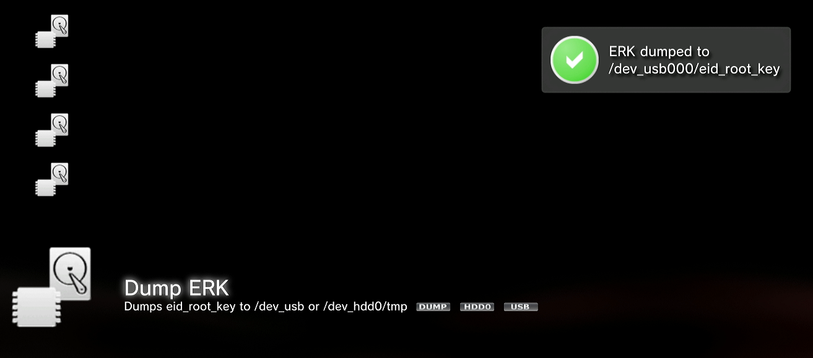
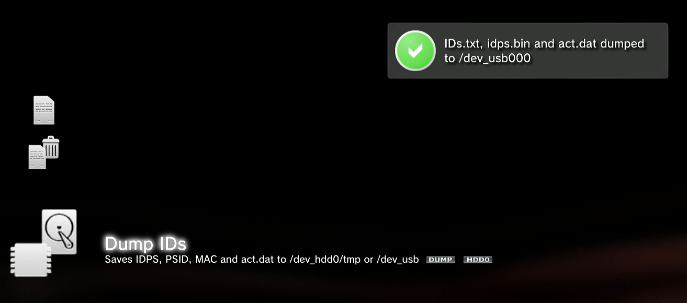
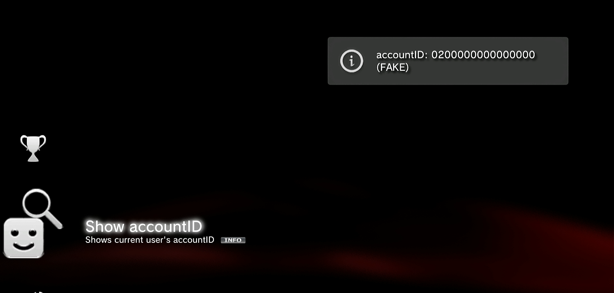

# Setup Guide

A step by step guide to using UFS2Xplorer. 
[Video guide](https://www.youtube.com/watch?v=sUiCR1nPTgs)

## What you need

- A PS3 hard drive, and a way to connect it to your PC (a SATA header on your motherboard, or a SATA to USB adapter).
- Your console's **EID root key** (48 bytes, shown as 96 hex characters). This is what decrypts the drive. It is unique to your console.
- Optional, only needed to install licenses:
  - Your **IDPS** (16 bytes, 32 hex characters).
  - Your **account id**.

The EID key and IDPS come from your own console. You dump them from your PS3 once, using the usual homebrew tools such as xai_plugin, and then keep them. UFS2Xplorer does not get them for you and does not send them anywhere. They are saved locally so you only enter them once.

## Step 0: Obtaining your keys

Through Evilnat custom firmwares, you can use xai_plugin to dump your ERK, IDPS and account ID on a USB drive

* EID root key:

* IDS:

* Account ID:

## Step 1: Connect the drive

Shut down the PS3, remove the hard drive, and connect it to your PC. A USB to SATA adapter is the easiest way. Windows may say the drive is unformatted or ask to format it. **Do not format it.** That is just Windows not understanding the PS3 filesystem.

## Step 2: Run as administrator

Right click UFS2Xplorer and choose **Run as administrator**. Reading a raw disk needs admin rights, so the drive will not show up otherwise.

## Step 3: Add your drive

1. Click **Add Drive**.
2. Pick your PS3 disk from the list. It is usually the one shown as unformatted.
3. Enter your EID key.
4. If you want to install licenses, enter your IDPS and account id as well.
5. Give it a name and finish.

Your details are saved, so next time you just pick the drive and open it.

## Step 4: Open and browse

Select the drive and click **Open**. You will see the drive's folders (game, home, mms, and so on). From here you can:

- Browse and extract files.
- Drag files or folders in from your PC to copy them onto the drive.
- Right click for cut, copy, paste, rename, and properties.

## Step 5: Install a game, update, or DLC

1. Click **Install PKG**, or drag one or more `.pkg` files onto the window.
2. The install window shows what each package is (game, update, DLC, classic, and so on).
3. Click **Install**. For a batch it installs them in order and checks the disk at the end.

If a package needs a license, install it next.

## Step 6: Install licenses

DLC and some games need a `.rif` license, which UFS2Xplorer builds from your `.rap` files.

- For one license, use **Install License** and pick the `.rap`.
- For many at once, use **Tools > Install Licenses** and select all the `.rap` files.

Licenses are written for every user on the console, so any account can use the content.

## Step 7: Make the games appear

The console keeps its own list of installed games. After installing, that list needs a rebuild. UFS2Xplorer flags this this automatically upon booting for you. On the PS3, boot into Safe Mode and choose **Rebuild Database**, and your new games will show up if you wish to do it manually.

## Step 8: Eject before unplugging

When you are finished, click **Eject**. This flushes any pending writes and stops the drive from spinning up so it is safe to unplug. Do not just pull the cable.

## If something goes wrong

- **The drive is not listed.** Make sure you ran as administrator, and that the adapter is connected.
- **It will not open, or shows errors.** The EID key is probably wrong for this drive. Double check it in **Tools > Manage Drives**.
- **Games do not show up on the console.** Do the Safe Mode Rebuild Database step above.
- **A check reports free space problems.** Use **Repair Free Counts**, then check again.

## A note on safety

Everything here writes to a real disk. Keep a backup, use Eject every time, and never interrupt an install or pull the drive mid write.